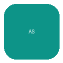

<!-- prettier-ignore -->
<div align="center">



# Account Switcher

*Switch between multiple accounts for 41 apps — ChatGPT, Claude, Gemini, Canva, Notion, Figma, GitHub, Netflix, Spotify, and many more*

[](https://developer.chrome.com/docs/extensions/)
[](https://developer.chrome.com/docs/extensions/develop/concepts/mv3-overview)
[](LICENSE)

[Features](#features) • [Installation](#installation) • [Usage](#usage) • [Backup & Restore](#backup--restore) • [Troubleshooting](#troubleshooting)

</div>

A lightweight browser extension that lets you save and switch between multiple accounts across 41 web apps — including AI chat assistants, design & dev tools, media streaming, and music services — without logging out and back in. Sessions are stored locally in your browser and can be exported or imported as JSON files for backup or migration.

## Supported Apps

**41 apps** across four categories:

| App | Domains |
|-----|---------|
| **ChatGPT** | `chatgpt.com`, `openai.com` |
| **Claude** | `claude.ai` |
| **Gemini** | `gemini.google.com` |
| **Perplexity** | `perplexity.ai` |
| **Poe** | `poe.com` |
| **Microsoft Copilot** | `copilot.microsoft.com` |
| **Grok** | `x.com`, `grok.com` |
| **DeepSeek** | `chat.deepseek.com` |
| **HuggingChat** | `huggingface.co` |
| **NotebookLM** | `notebooklm.google.com` |
| **Cursor** | `cursor.com` |
| **Canva** | `canva.com` |
| **Figma** | `figma.com` |
| **v0** | `v0.dev` |
| **Lovable** | `lovable.dev` |
| **Replit** | `replit.com` |
| **Notion** | `notion.so`, `notion.site` |
| **GitHub** | `github.com` |
| **Slack** | `slack.com` |
| **Vercel** | `vercel.com` |
| **Lark** | `larksuite.com` |
| **WhatsApp** | `whatsapp.com` |
| **Facebook** | `facebook.com` |
| **Netflix** | `netflix.com` |
| **Disney+** | `disneyplus.com` |
| **Prime Video** | `primevideo.com` |
| **Max** | `max.com` |
| **Hulu** | `hulu.com` |
| **Crunchyroll** | `crunchyroll.com` |
| **Viu** | `viu.com` |
| **WeTV** | `wetv.com` |
| **Hotstar** | `hotstar.com` |
| **Bstation** | `bilibili.tv` |
| **Midjourney** | `midjourney.com` |
| **Runway** | `runwayml.com` |
| **Spotify** | `open.spotify.com`, `spotify.com` |
| **Deezer** | `deezer.com` |
| **SoundCloud** | `soundcloud.com` |
| **Tidal** | `tidal.com` |
| **Pandora** | `pandora.com` |
| **Bandcamp** | `bandcamp.com` |

> Google apps (Gemini, NotebookLM) switch via the `?authuser` URL index rather than cookie-swap, so other Google accounts stay logged in. All other apps use the cookie-swap method.

## Features

- **41 apps, one extension** — AI chat, design/dev, streaming, and music
- **One-click switching** — Instantly swap between saved sessions
- **Per-app tabs** — Clean tabbed UI to switch between apps
- **App search** — Filter the app list from the main menu to jump to any app fast
- **Sort filter** — Sort the app grid by name (A→Z / Z→A), most/fewest saved accounts, or newest/oldest apps — sits right next to the search box
- **Themed interface** — Each app gets its own brand color and icon
- **Session backup** — Export all or selected sessions to a JSON file
- **Import** — Restore sessions from an export file, on any machine
- **Account management** — Rename or delete saved accounts at any time
- **Zero dependencies** — Plain HTML, CSS and JavaScript, no build step required

## How it works

When you save a session, the extension captures all cookies for the selected app's domains — including partitioned (CHIPS) cookies — and stores them in `chrome.storage.local` under an app-specific key. Switching accounts clears the current session cookies and restores the ones from the selected account, then reloads any open tabs for that app.

For Google properties (Gemini, NotebookLM) the real login tokens live in shared SSO cookies, so cookie-swap would log every Google account out. Those apps instead switch via the `?authuser=N` URL index and never touch cookies.

No data ever leaves your browser: everything stays in local storage unless you explicitly export it yourself.

## Project Structure

Per-app configuration is split into its own file so each supported app is maintained in isolation. The engine modules are fully generic and never reference an app by name.

```
account-switcher/
├── manifest.json          # MV3 manifest + host_permissions (domain allowlist)
├── popup.html             # loads config → apps → engine scripts in order
├── popup.css
├── background.js          # service worker
├── icons/
└── js/
    ├── config.js          # APPS = {} registry + shared state (currentApp, selectedNames)
    ├── apps/              # one file per supported app (41 files)
    │   ├── chatgpt.js
    │   ├── claude.js
    │   ├── gemini.js
    │   └── ... (one file per app)
    ├── cookies.js         # capture / restore cookies for the active app
    ├── storage.js         # chrome.storage.local wrapper (per-app key)
    ├── modal.js           # shared confirm/prompt modal
    ├── ui.js              # render cards + account list + sort logic
    ├── actions.js         # save / switch / rename / delete / clear
    ├── export.js          # export / import sessions as JSON
    └── app.js             # popup wiring + bootstrap
```

Each file under `js/apps/` registers itself by assigning to the shared `APPS` object, e.g.:

```js
// js/apps/chatgpt.js
APPS.chatgpt = {
  name: 'ChatGPT',
  color: '#10A37F',
  icon: `<svg …>`,
  domains: ['chatgpt.com', 'openai.com'],
  tabs: ['https://chatgpt.com/*', 'https://*.chatgpt.com/*', 'https://chat.openai.com/*']
};
```

## Adding a Supported App

Because the engine is app-agnostic, adding a service is pure data — no engine changes required.

1. **Create `js/apps/<id>.js`** registering the app on `APPS` (see the example above). Use a stable lowercase `id`.
2. **Add its domains** to `host_permissions` in `manifest.json` (e.g. `"https://perplexity.ai/*"`). This step is mandatory — the browser blocks cookie access to any domain not listed here.
3. **Load the script** in `popup.html` between `js/config.js` and `js/cookies.js`:
   ```html
   <script src="js/apps/<id>.js"></script>
   ```
4. Reload the extension from `chrome://extensions` and the new app appears as a card automatically.

> [!NOTE]
> `manifest.json` cannot be split per app, so the domain allowlist stays centralized there. Everything else about an app lives in its own `js/apps/<id>.js` file.

## Installation

The extension is not published yet — install it manually from the source:

1. Download or clone this repository:
   ```bash
   git clone https://github.com/machfudn/account-switcher.git
   ```
2. Open Chrome (or any Chromium-based browser) and go to `chrome://extensions`.
3. Enable **Developer mode** using the toggle in the top-right corner.
4. Click **Load unpacked** and select the project folder.
5. Pin the extension to your toolbar for quick access.

> [!NOTE]
> The extension requests `storage`, `cookies` and `tabs` permissions, scoped to the supported app domains only. It cannot read cookies from any other website.

## Usage

### Save your first account

1. Log in to your account on any supported app.
2. Open the extension popup and select the app tab.
3. Enter a name under **Save Session** (for example, *work*) and click **Save**.
4. Repeat for each account you want to keep.

### Switch accounts

Open the popup, select the app tab, and click **Switch** next to the account you want to use. Your current session is replaced by the saved one and all open tabs for that app are reloaded automatically.

### Sort & search the app grid

On the home screen, type in the search box to filter by name/domain, and use the **sort** dropdown next to it to reorder the app grid:

| Sort option | Order |
| --- | --- |
| Name (A–Z) | Alphabetical, ascending |
| Name (Z–A) | Alphabetical, descending |
| Most saved | Apps with the most saved accounts first |
| Fewest saved | Apps with the fewest saved accounts first |
| Newest apps | Apps in definition order (last added first) |
| Oldest apps | Apps in definition order (first added first) |

### Manage accounts

| Action | Description |
| --- | --- |
| **Rename** | Change the display name of a saved account |
| **Delete** | Remove a single saved session |
| **Clear All Sessions** | Wipe every saved account for the current app |

## Backup & Restore

In the popup's **Backup** section:

- Click **Export All** to download all saved sessions for the current app, or tick individual accounts and click **Export Selected**.
- Click **Import** to load sessions from an exported file. Accounts with the same name are overwritten.

> [!WARNING]
> Exported files contain full login session tokens. Anyone with access to the file can access those accounts without a password. Store exports securely and never share them.

## Troubleshooting

**Switching doesn't log me in**
Re-save the account while logged in, then try again. Expired sessions can't be restored — simply log in again and overwrite the saved account.

**Some cookies failed to restore**
If you see a warning message, some cookies were rejected by the browser. Reload the extension from `chrome://extensions`, re-save the affected account, and switch again.

**Exported file fails to import**
Only files exported by this extension are accepted, and they must contain at least one valid account entry.

## Disclaimer

This extension is not affiliated with, endorsed by, or connected to any of the services it supports. Use of multiple accounts must comply with each service's terms of service.
